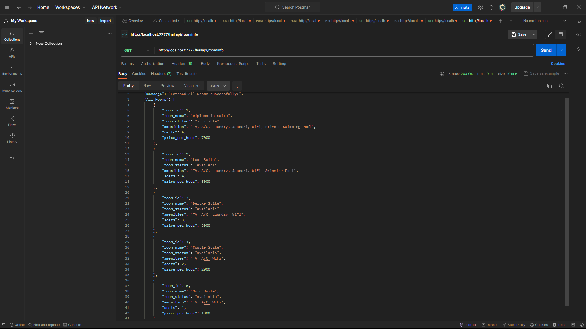
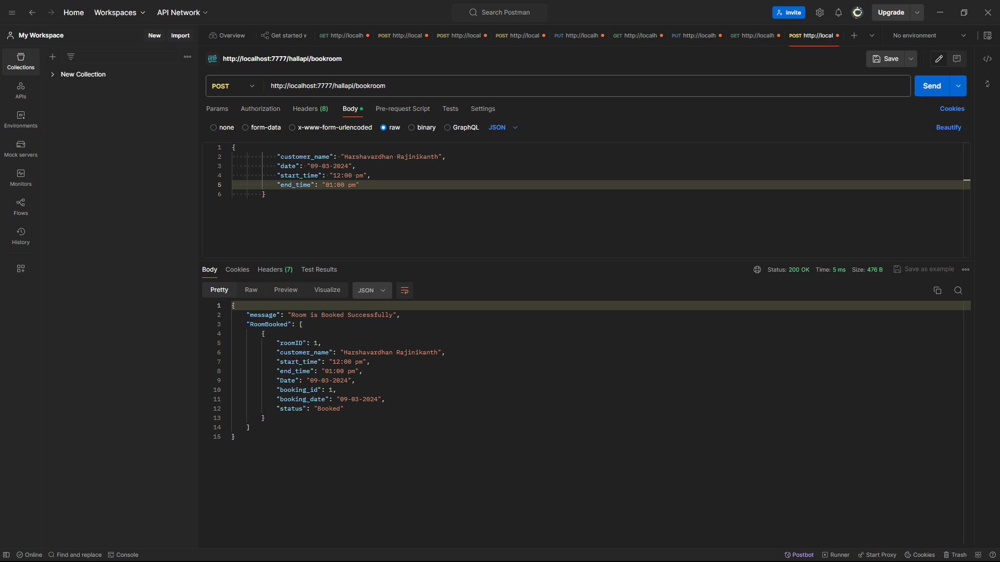

# NodeJS Hall Booking API Task

**This repository is created for NodeJS Hall Booking API Task** 


This Web application is created for managing rooms booking  in a Hall.

## Endpoints with Output Screenshots

### List All the Booked Rooms: View a list of all booked rooms along with customer details and booking information.
- GET: Use the endpoint/hallapi/roominfo to get the All Room Details
  


### Create Room: Easily create new rooms with specified details such as capacity, amenities, and price per hour.
- POST: Change the endpoint/hallapi/createroom to Create a New Room
  
  


### Book Room: Seamlessly book available rooms for specific dates and times, ensuring no double bookings.
- POST: Change the endpoint/hallapi/bookroom to Book a New Room
  
  
  

### List the Booked Rooms: Get insights into all booked rooms, including Customer Information. 
- GET: Change the endpoint/hallapi/bookedroomdata to retrieve all the Booked Room Data
  


### List Customers Booked Rooms Data: Get insights into all customers who have booked rooms, including their booking history.
- GET: Change the endpoint/hallapi/customersbookeddata to retrieve all the Customers Booked Room Data
  


### List Customer Booking Count: Get booking details for each customer along with booking count.
- GET: Change the endpoint/hallapi/customerbookingcount to retrieve Booking Counts and Room Data for Booked Customers
  

## NodeJS
  - It is used for server-side programming, and primarily deployed for non-blocking, event-driven servers, such as traditional web sites and back-end API services, but was originally designed with real-time, push-based architectures in mind. Every browser has its own version of a JS engine, and node.

## ExpressJS
  - Express is a node js web application framework that provides broad features for building web and mobile applications. It is used to build a single page, multipage, and hybrid web application. It's a layer built on the top of the Node js that helps manage servers and routes.


## JSON Data Schema

- **Room Object Schema**

```json
{
  "room_id": 1,
  "room_name": "Diplomatic Suite",
  "room_status": "available",
  "amenities": "TV, A/C, Laundry, Jaccuzi, WiFi, Private Swimming Pool",
  "seats": 5,
  "price_per_hour": 7000
}
```

- **Booking Object Schema**

```json
{
  "roomID": 1,
  "booking_date": "09-03-2024",
  "start_time": "12:00 pm",
  "end_time": "01:00 pm",
  "booking_id": 1,
  "status": "Booked"
}
```